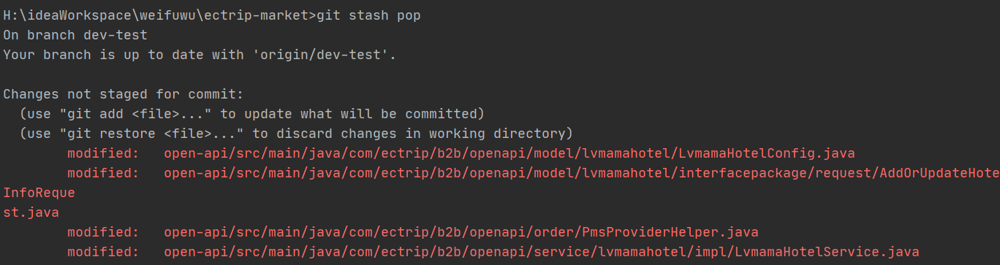
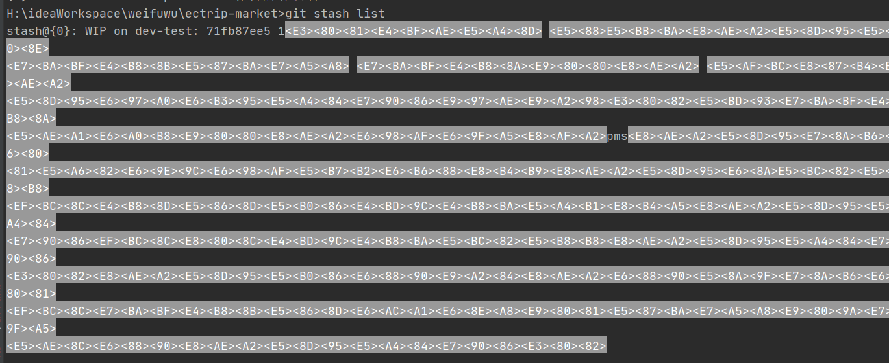

# Git使用整理

==git官方地址==：https://git-scm.com/book/zh/v2

## 1、编写代码后需要切换分支，但又不想代码丢失。

解决：使用暂存代码后切换分支

原文：https://www.cnblogs.com/mzy520/p/11282751.html

官网地址：https://git-scm.com/book/zh/v2/Git-%E5%B7%A5%E5%85%B7-%E8%B4%AE%E8%97%8F%E4%B8%8E%E6%B8%85%E7%90%86

场景：

```
A：提交后切换，代码保存到分支 feature_666，却产生一个无意义的提交
B：不提交直接切换，然而这个选项根本没人会选。
C：使用 git stash , 将当前修改(未提交的代码)存入缓存区，切换分支修改 bug ,回来再通过 git stash pop 取出来。
```

### 1、保存到暂存区域

git stash //将修改存储到暂存区，工作区会删除这些修改

git checkout <bug_branch>

### 2、查看修改

如果你有丢失代码的经历，肯定会对这个之前没接触的新命令不放心，那么怎么确定你操作成功了呢？

```
git stash show //查看刚才暂存的修改
```

### 3、取出修改

现在 bug 改完了，要重新回来开发了，取出修改

```
git checkout <feture_branch> //切换刚才功能开发的分支
git stash pop //取出修改
```

### 4、修改存储到什么位置了?

当我们使用 `git init`给项目添加版本控制的时候，会在项目路径下生成一个 `.git` 隐藏文件夹。`.git` 中存储着版本管理的所有信息。 
.git/refs/stash 中，存储的是最后一个 stash 对应的节点指针。同样，在 .git/log/refs/stash 中可以看到我们全部的 stash 记录信息。

**存储多个 stash 的情况**

*ok ,我们来尝试一下修改文件，然后再次使用 git stash ,此时我们有个两个 暂存修改，那么怎么查看呢？*

***git stash list //查看暂存区的所有暂存修改记录***

如果在未提交的情况下，执行 git stash 两次，无法准确分辨两个stash 具体修改的是哪些内容，这样用，显的伟大的 Git 一点都不智能，怎么可以！。

所以，在这种情况下，给 stash 存储的修改起个名字，显然非常重要，方式如下：

git stash save <message>

**取出也有好几种方式**
上面的演示中，取出 stash 的方式都是

git stash pop //取出最近一次暂存并删除记录列表中对应记录



这是一个非常好用的取出方式，一般使用的频率最高，但并非适用所有情况。

因为 git stash pop 是弹出栈顶的一个 stash ，也就是最后一次存储的 stash。在存储多个stash ，想取出非栈顶的一个的情况下，是不适用的。

这个时候要使用：

git stash list //查看暂存区的所有暂存修改

git stash apply stash@{X} //取出相应的暂存
git stash drop stash@{X} //将记录列表中取出的对应暂存记录删除