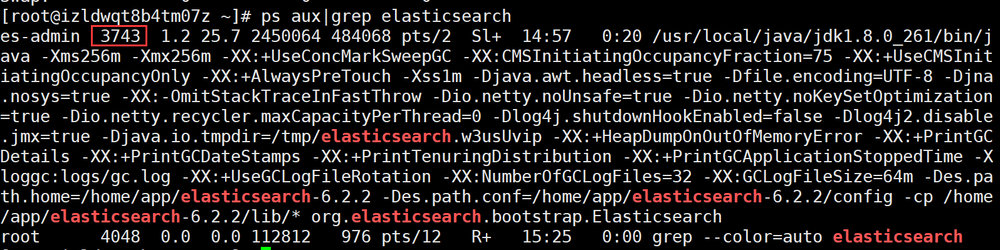

```java
cd abc -> 进入子目录
cd/ -> 进入根目录
ll -> 显示当前路径文件（详细）
ls -> 同上（简略）
cp -> 拷贝
mkdir -> 创建目录
rm -> 删除文件或文件夹
mv -> 移动文件或改名
clear -> 清屏
pwd -> 显示当前路径
more -> 显示文本文档
uname -a -> 查看当前核心版本号
vim -> 文本编辑器
fdisk -> 硬盘分区
mkfs -> 格式化
chmod -> 改变文件权限
free -> 查看剩余内存
grep -> 按条件高亮显示文本
man -> 显示命令的help文档
df -h -> 查看磁盘剩余空间
du -sh dir -> 查看文件夹名"dir"占用的空间
lsof -i:8080 -> 查看8080端口是否被占用
find . -name "filename.txt" -> 搜索当前目录下filename.txt文件，包括各级子目录
netstat -lntp 5000 查看端口是否占用
tail -n 20 filename (显示filename最后20行)
-f 该参数用于监视File文件增长。
-c Number 从 Number 字节位置读取指定文件
-n Number 从 Number 行位置读取指定文件。倒叙 -n 从最后n行开始
-m Number 从 Number 多字节字符位置读取指定文件，比方你的文件假设包括中文字，假设指定-c参数，可能导致截断，但使用-m则会避免该问题。
-b Number 从 Number 表示的512字节块位置读取指定文件。
-k Number 从 Number 表示的1KB块位置读取指定文件。
 
chmod -R 777 dir （将dir整体变为777）
rm -rf dir (整体删除dir)
cp -r -a ./* /dir (将当前路径下所有文件包括子目录全部拷贝到dir)

tar -xvzf filename (解压缩gz文件) -C file
gzip -d filename (解压缩gz文件)
unzip -x filename (解压缩zip文件)
rpm -ivh （安装一个包）
rpm -Uvh （升级一个包）
rpm -e （卸载一个包）

//给用户增加权限
chown [-cfhvR] [--help] [--version] user[:group] file...
参数 :
user : 新的文件拥有者的使用者 ID
group : 新的文件拥有者的使用者组(group)
-c : 显示更改的部分的信息
-f : 忽略错误信息
-h :修复符号链接
-v : 显示详细的处理信息
-R : 处理指定目录以及其子目录下的所有文件
--help : 显示辅助说明
--version : 显示版本


查看是否安装
rpm -qa | grep mongodb
```


# 进程相关

相关博客：https://blog.csdn.net/m0_37673307/article/details/81534690

## 1、查看进程是否存在
ps -aux | grep elasticsearch


## 2、杀死进程

kill ==-9== 进程id

## 3、查看进程列表

ps -ef


# Screen

https://www.dazhuanlan.com/2019/12/24/5e0206a8f1cba/

基本命令：

screen -R name 新建一个会话

screen -x name 进入已存在的会话

screen -X -S id 删除一个会话