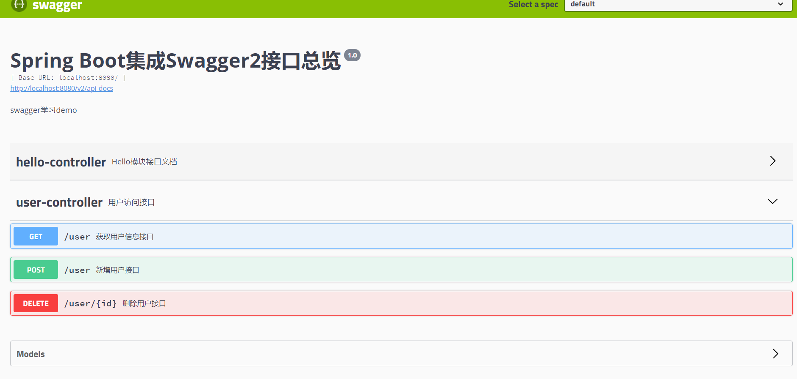

# springboot + swagger 自动生成API文档


## 一、版本

- springboot 2.3.4.RELEASE
- swagger 2.9.2

## 二、整合步骤

### 1、配置swagger

```java
/**
 * @Author: stopping
 * @Date: 2020/10/21 15:21
 * 转载注明出处、个人博客网站:www.stopping.top
 */
@Configuration
//启动swagger
@EnableSwagger2
public class SwaggerConfig {
    @Bean
    public Docket createRestApi() {
        return new Docket(DocumentationType.SWAGGER_2)
                // 指定构建api文档的详细信息的方法：apiInfo()
                .apiInfo(apiInfo())
                .select()
                // 指定要生成api接口的包路径，这里把controller作为包路径，生成controller中的所有接口
                .apis(RequestHandlerSelectors.basePackage("com.stopping.swaggerdemo.controller"))
                .paths(PathSelectors.any())
                .build();
    }

    private ApiInfo apiInfo() {
        return new ApiInfoBuilder()
                // 设置页面标题
                .title("Spring Boot集成Swagger2接口总览")
                // 设置接口描述
                .description("swagger学习demo")
                // 设置版本
                .version("1.0")
                // 构建
                .build();
    }
}
```


### 2、编写实体类api

```java
/**
 * @Author: stopping
 * @Date: 2020/10/21 16:21
 * 转载注明出处、个人博客网站:www.stopping.top
 */
@ApiModel(value = "用户实体类")
@Getter
@Setter
@AllArgsConstructor
public class User {
    @ApiModelProperty(value = "用户id")
    /**
     * 用户ID
     * */
    private Long id;
    @ApiModelProperty(value = "用户名")
    private String name;
    @ApiModelProperty(value = "用户密码")
    private String password;
}

```


### 3、在指定包目录编写接口

```java
/**
 * @Author: stopping
 * @Date: 2020/10/22 09:22
 * 转载注明出处、个人博客网站:www.stopping.top
 */
@Api(description = "用户访问接口")
@RestController
public class UserController {
    List<User> list = new ArrayList();

    @GetMapping("/user")
    @ApiOperation(value = "获取用户信息接口")
    public Response getUser(){
        return  new Response().success(list);
    }

    @PostMapping("/user")
    @ApiOperation(value = "新增用户接口")
    public Response addUser(@RequestBody @ApiParam("用户信息") User user){
        list.add(user);
        return new Response().success("");
    }
    @ApiOperation("删除用户接口")
    @DeleteMapping("/user/{id}")
    public Response insertUser(@PathVariable @ApiParam("用户body") long id){
        for(int i = 0;i<list.size();i++){
            if (list.get(i).getId() == id){
                list.remove(i);
                return new Response().success(list.get(i));
            }
        }
        return new Response().fail();
    }
}

```



## 三、运行服务查看swagger文档

- 访问地址：http://localhost:8080/swagger-ui.html
- 调试接口

## 四、注解说明

https://blog.csdn.net/wyb880501/article/details/79576784

https://zhuanlan.zhihu.com/p/49996147

1、**@Api()**：用在请求的类上，表示对类的说明，也代表了这个类是swagger2的资源

参数：

```text
tags：说明该类的作用，参数是个数组，可以填多个。
value="该参数没什么意义，在UI界面上不显示，所以不用配置"
description = "用户基本信息操作"
```

2、**@ApiOperation()**：用于方法，表示一个http请求访问该方法的操作

参数：

```text
value="方法的用途和作用"    
notes="方法的注意事项和备注"    
tags：说明该方法的作用，参数是个数组，可以填多个。
格式：tags={"作用1","作用2"} 
（在这里建议不使用这个参数，会使界面看上去有点乱，前两个常用）
```

3、**@ApiModel()**：用于响应实体类上，用于说明实体作用

参数：

```text
description="描述实体的作用"  
```

4、**@ApiModelProperty**：用在属性上，描述实体类的属性

参数：

```text
value="用户名"  描述参数的意义
name="name"    参数的变量名
required=true     参数是否必选
```

5、**@ApiImplicitParams**：用在请求的方法上，包含多@ApiImplicitParam

6、**@ApiImplicitParam**：用于方法，表示单独的请求参数

参数：

```text
name="参数ming" 
value="参数说明" 
dataType="数据类型" 
paramType="query" 表示参数放在哪里
    · header 请求参数的获取：@RequestHeader
    · query   请求参数的获取：@RequestParam
    · path（用于restful接口） 请求参数的获取：@PathVariable
    · body（不常用）
    · form（不常用） 
defaultValue="参数的默认值"
required="true" 表示参数是否必须传
```

7、**@ApiParam()**：用于方法，参数，字段说明 表示对参数的要求和说明

参数：

```text
name="参数名称"
value="参数的简要说明"
defaultValue="参数默认值"
required="true" 表示属性是否必填，默认为false
```

8、**@ApiResponses**：用于请求的方法上，根据响应码表示不同响应

一个@ApiResponses包含多个@ApiResponse

9、**@ApiResponse**：用在请求的方法上，表示不同的响应

**参数**：

```text
code="404"    表示响应码(int型)，可自定义
message="状态码对应的响应信息"   
```

10、**@ApiIgnore()**：用于类或者方法上，不被显示在页面上

11、**@Profile({"dev", "test"})**：用于配置类上，表示只对开发和测试环境有用

## 五、补充

1、swagger 2.6一下版本是没有model的

