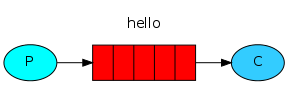

https://zhuanlan.zhihu.com/p/109037245

https://blog.csdn.net/u010715243/article/details/106764774/

docker run -di --name=websocket_rabbitmq -e RABBITMQ_DEFAULT_USER=root -e RABBITMQ_DEFAULT_PASS=root  -p 5671:5617 -p 34566:5672 -p 4369:4369 -p 15671:15671 -p 34567:15672 -p 25672:25672 -p 34568:15670 -p 15674:15674  rabbitmq:stomp

docker run -di --name=changgou_rabbitmq -p 5671:5617 -p 5672:5672 -p 4369:4369 -p 15671:15671 -p 15672:15672 -p 25672:25672 -p 15670:15670 -p 15674:15674 rabbitmq:stomp

# 一、AMQP协议

# 二、MQ

### 1、MQ的主要特点

- 队列
- 异步

### 2、MQ的运用场景

- 异步通信（取代定时器）
- 解耦
- 流量削峰

### 3、所带来的问题

- 系统的可用性
- 复杂性

# 二、RabbitMq

## 1、RabbitMq的基本特性

- 高可用
- 灵活的路由
- 支持多客户端 java、py、js...

## 2、RabbitMq主要组件

### Exchange 交换机

- 连接方式
  - Direct直连
  - 

### Channel 通道

### Queue队列

## 3、Java基础使用

#### - 基本的消息队列通信

​	

## 3、插件 RabbitMQ Web STOMP Plugin

