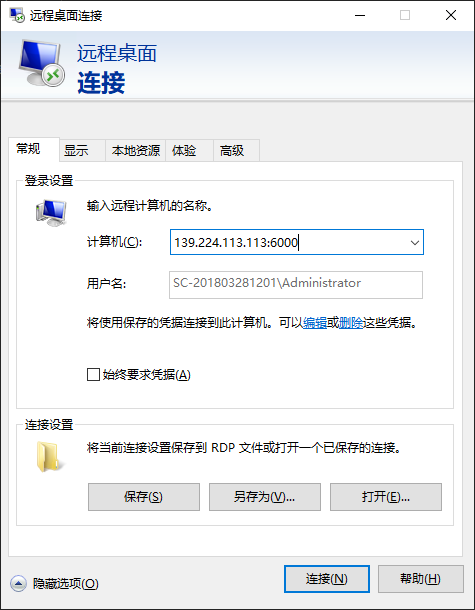
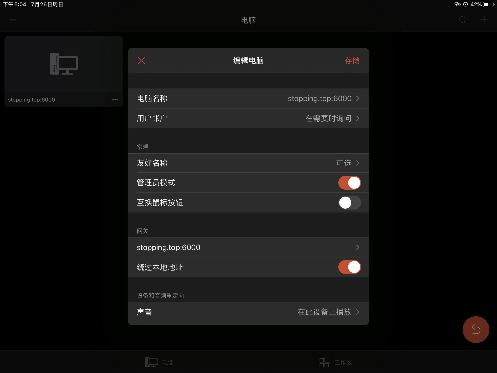

# 一、需要的软件

1、个人服务器

2、frp GitHub下载：https://github.com/fatedier/frp/releases/tag/v0.33.0

# 二、服务器端frp

1、下载：[frp_0.33.0_linux_amd64.tar.gz](https://github.com/fatedier/frp/releases/download/v0.33.0/frp_0.33.0_linux_amd64.tar.gz)

2、放到服务器并解压 tar xf frp_0.33.0_linux_amd64.tar.gz

3、修改**frps**.ini配置

```
[common]
server_port = 7000
```

4、安装Screen 是服务器后台运行frp

	-	yum install screen -y 安装
	-	screen -S frp 指定一个frp的会话
	-	./frps -c frps.ini 运行


5、出现start frps success则成功运行


# 三、客户端frp

1、下载：[frp_0.33.0_windows_amd64.zip](https://github.com/fatedier/frp/releases/download/v0.33.0/frp_0.33.0_windows_amd64.zip)

2、修改frpc.ini配置文件

```
[common]
server_addr = 139.224.113.113 服务器ip
server_port = 7000 服务器绑定的端口

[ssh]
type = tcp
local_ip = 127.0.0.1
local_port = 3389 //本地开放的接口
remote_port = 6000 //远程桌面调用的端口
```

3、运行客户端frp,保持运行

```
PS C:\Users\Administrator> cd F:\app\远程工具\frp_0.33.0_windows_amd64
PS F:\app\远程工具\frp_0.33.0_windows_amd64> .\frpc.exe -c .\frpc.ini
2020/07/20 10:14:19 [I] [service.go:282] [1849f6307940fdf4] login to server success, get run id [1849f6307940fdf4], server udp port [0]
2020/07/20 10:14:19 [I] [proxy_manager.go:144] [1849f6307940fdf4] proxy added: [ssh]
2020/07/20 10:14:19 [I] [control.go:179] [1849f6307940fdf4] [ssh] start proxy success

```


# 四、远程桌面

1、设置允许远程 我的电脑 - 右键属性 -远程设置 - 允许





# 五、开机自动启动

1、cmd-regedit

2、进入计算机\HKEY_CURRENT_USER\Software\Microsoft\Windows\CurrentVersion\Run

3、右键-新建-字符串-粘贴启动方式地址


# 六、IOS端实现远程控制

1、下载软软件Microsoft远程控制

​	