# 一、基础篇

## 

> 下载：下载地址：链接：https://pan.baidu.com/s/1dYYaewxGSLm8edeV5JAXhw 
> 提取码：ayqa

# 二、数据库操作

## 1、操作数据库


## 2、操作表

### （1）增 Create table

语法：CREATE TABLE USER ( id INT ( 4 ),类名 数据类型 )

### （2）删

语法：DROP TABLE table_name

### （3）查

语法：DESCRIBE table_name

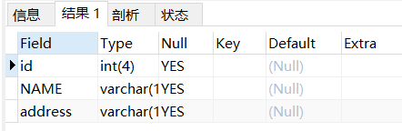

### （4）改

修改表名：

ALTER TABLE user RENAME userinfo
> OK
> 时间: 0.022s

添加表字段：

语法：ALTER table userinfo ADD age INT

​	添加多个字段：ALTER table userinfo ADD (num INT,phone VARCHAR(13)) [AFTER field]

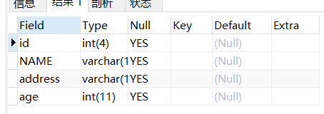

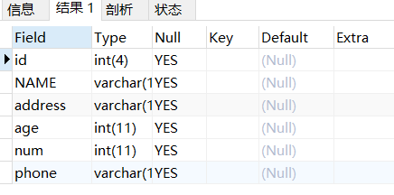


## 3、操作视图


# 三、表操作

## 1、单表操作

### 增 

语法：insert INTO table_name(filed1,filed2) VALUES(value11,value12) ,(value21,value22)，...,(value,value)

### 改

语法：

```sql
UPDATE table_name SET column_name = new_value
[WHERE column_name = some_value]
//没有where就是全部修改
```

### 删

语法：

```sql
DELETE FROM table_name WHERE column_name = some_value
```

### 查

```sql
SELECT select_list 
// DISTINCT filed 将该字段唯一值显示
[ INTO new_table ] 
FROM table_source 
[ WHERE search_condition ]  
//条件限制 可以使用AND 或者 OR 连接筛选逻辑
//[NOT] BETWEEN value1 AND value2 限制范围
[ GROUP BY group_by_expression ] 
//对结果集进行分组，常与汇总函数一起使用。分组排序 默认ASC分组 
[ HAVING search_condition ] 
//指定群组或汇总的搜寻条件。
[ ORDER BY order_expression [ ASC | DESC ] ] 
//指定结果集的排序，可以按照 ASC（递增方式排序，从最低值到最高值）或者 DESC（递减方式排序，从最高值到最低值）的方式进行排序，默认的方式是 ASC。
//注意区别 Order By 和 Group By 的区别 相同的是都有排序核心是有无分组。
```

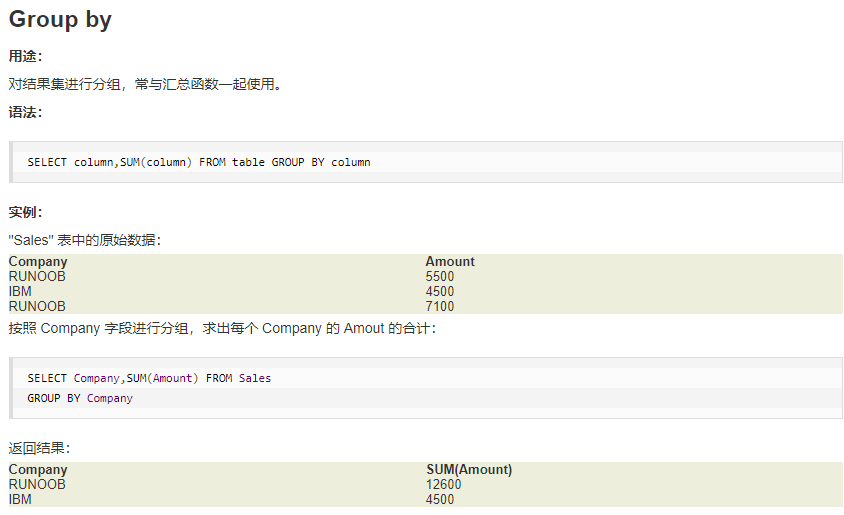

having 通常作为Group By 子句作为筛选条件

SELECT name,SUM(age) AS sumage FROM cstudent GROUP BY `NAME` HAVING sumage > 18

如上sql语句的意思是，在cstudent表中，把name作为分组即相同的name合并，得到年龄总数大于18的数据。


## 2、多表操作

### 并表操作  UNION

将两个表的合并再一起，这里区别左右拼接而是相同字段的数据进行拼接。

cstudent

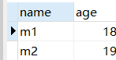

mstudent

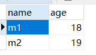

``` sql
	SELECT * FROM  cstudent UNION|[UNION ALL] SELECT * FROM fstudent
	//说明：UNION 去重复 | UNION ALL 不去重复
```

结果：

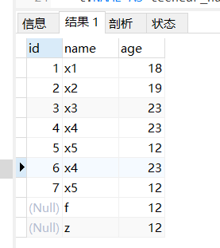

## JOIN

### 内连接

1、From拼接多个表数据

作用：将两个表的数据连接起来.

FROM后面增加需要连接的表

例如：

查看老师班级的学生

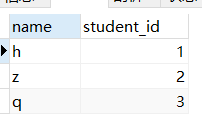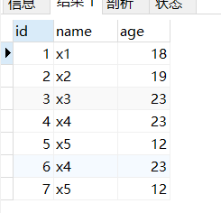

``` sql
SELECT
	t.NAME,
	cs.`name` AS studentname 
FROM
	techear t,
	cstudent cs 
WHERE
	t.student_id = cs.id
```

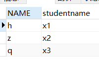


2、使用INNER JOIN table_name ON Condication(Mysql内连接推荐)

``` sql
SELECT
	t.NAME AS techear_name,
	c.NAME AS student_name 
FROM
	techear t
	INNER JOIN cstudent c ON t.student_id = c.id
```


3、INNER 多张表数据

( order_list ol INNER JOIN order_info oi ON ol.order_id = oi.id ) 连接两张表的数据后在Inner join多一张数据表。

```sql
SELECT
	ol.price AS 价格,
	ol.price_type AS 价格类型,
	oi.order_code AS 订单号 ,
	p.`name` AS 产品名称·
FROM
	( ( order_list ol INNER JOIN order_info oi ON ol.order_id = oi.id ) INNER JOIN product p ON p.id = ol.product_id)
```


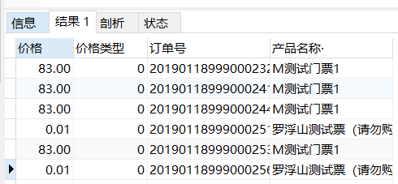

### 外连接

#### LEFT JOIN 左外连接

1、作用：将JOIN左边的表数据全部读取，无论条件是否匹配。

2、代码

``` sql
SELECT
	t.NAME AS techear_name,
	c.NAME AS student_name 
FROM
	techear t
	LEFT JOIN cstudent c ON t.student_id = c.id
```

3、效果

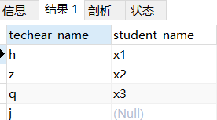

#### RIGHT JOIN 右外连接

1、作用：将JOIN右边的表数据全部读取，无论条件是否匹配。

2、代码

``` sql
SELECT
	t.NAME AS techear_name,
	c.NAME AS student_name 
FROM
	techear t
	RIGHT JOIN cstudent c ON t.student_id = c.id
```

3、效果

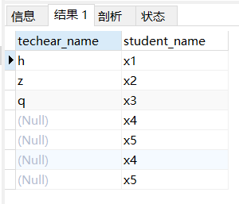

### 子查询

因为连接查询的性能比较差，如果能用子查询的话效率更好。

select * from table_1 t1 where t1.filed > 

(select * from table_2 t2 where Condition)

#### 子查询返回单条结果

在Where子句中使用比较运算符(<,>,=,!=)

#### 子查询返回多条结果


# 四、函数操作

## 1、日期操作函数

- 日期函数大全 内附连接跳转查看
- 

| 名称                                                         | 描述                                                         |
| ------------------------------------------------------------ | ------------------------------------------------------------ |
| [`ADDDATE()`](https://dev.mysql.com/doc/refman/5.6/en/date-and-time-functions.html#function_adddate) | 将时间值（间隔）添加到日期值                                 |
| [`ADDTIME()`](https://dev.mysql.com/doc/refman/5.6/en/date-and-time-functions.html#function_addtime) | 加时间                                                       |
| [`CONVERT_TZ()`](https://dev.mysql.com/doc/refman/5.6/en/date-and-time-functions.html#function_convert-tz) | 从一个时区转换到另一个时区                                   |
| [`CURDATE()`](https://dev.mysql.com/doc/refman/5.6/en/date-and-time-functions.html#function_curdate) | 返回当前日期                                                 |
| [`CURRENT_DATE()`， `CURRENT_DATE`](https://dev.mysql.com/doc/refman/5.6/en/date-and-time-functions.html#function_current-date) | CURDATE（）的同义词                                          |
| [`CURRENT_TIME()`， `CURRENT_TIME`](https://dev.mysql.com/doc/refman/5.6/en/date-and-time-functions.html#function_current-time) | CURTIME（）的同义词                                          |
| [`CURRENT_TIMESTAMP()`， `CURRENT_TIMESTAMP`](https://dev.mysql.com/doc/refman/5.6/en/date-and-time-functions.html#function_current-timestamp) | NOW（）的同义词                                              |
| [`CURTIME()`](https://dev.mysql.com/doc/refman/5.6/en/date-and-time-functions.html#function_curtime) | 返回当前时间                                                 |
| [`DATE()`](https://dev.mysql.com/doc/refman/5.6/en/date-and-time-functions.html#function_date) | 提取日期或日期时间表达式的日期部分                           |
| [`DATE_ADD()`](https://dev.mysql.com/doc/refman/5.6/en/date-and-time-functions.html#function_date-add) | 将时间值（间隔）添加到日期值                                 |
| [`DATE_FORMAT()`](https://dev.mysql.com/doc/refman/5.6/en/date-and-time-functions.html#function_date-format) | 指定格式日期                                                 |
| [`DATE_SUB()`](https://dev.mysql.com/doc/refman/5.6/en/date-and-time-functions.html#function_date-sub) | 从日期中减去时间值（间隔）                                   |
| [`DATEDIFF()`](https://dev.mysql.com/doc/refman/5.6/en/date-and-time-functions.html#function_datediff) | 减去两个日期                                                 |
| [`DAY()`](https://dev.mysql.com/doc/refman/5.6/en/date-and-time-functions.html#function_day) | DAYOFMONTH（）的同义词                                       |
| [`DAYNAME()`](https://dev.mysql.com/doc/refman/5.6/en/date-and-time-functions.html#function_dayname) | 返回工作日的名称                                             |
| [`DAYOFMONTH()`](https://dev.mysql.com/doc/refman/5.6/en/date-and-time-functions.html#function_dayofmonth) | 返回月份中的一天（0-31）                                     |
| [`DAYOFWEEK()`](https://dev.mysql.com/doc/refman/5.6/en/date-and-time-functions.html#function_dayofweek) | 返回参数的工作日索引                                         |
| [`DAYOFYEAR()`](https://dev.mysql.com/doc/refman/5.6/en/date-and-time-functions.html#function_dayofyear) | 返回一年中的某天（1-366）                                    |
| [`EXTRACT()`](https://dev.mysql.com/doc/refman/5.6/en/date-and-time-functions.html#function_extract) | 提取部分日期                                                 |
| [`FROM_DAYS()`](https://dev.mysql.com/doc/refman/5.6/en/date-and-time-functions.html#function_from-days) | 将天数转换为日期                                             |
| [`FROM_UNIXTIME()`](https://dev.mysql.com/doc/refman/5.6/en/date-and-time-functions.html#function_from-unixtime) | 将Unix时间戳记格式化为日期                                   |
| [`GET_FORMAT()`](https://dev.mysql.com/doc/refman/5.6/en/date-and-time-functions.html#function_get-format) | 返回日期格式字符串                                           |
| [`HOUR()`](https://dev.mysql.com/doc/refman/5.6/en/date-and-time-functions.html#function_hour) | 提取时间                                                     |
| [`LAST_DAY`](https://dev.mysql.com/doc/refman/5.6/en/date-and-time-functions.html#function_last-day) | 返回参数的月份的最后一天                                     |
| [`LOCALTIME()`， `LOCALTIME`](https://dev.mysql.com/doc/refman/5.6/en/date-and-time-functions.html#function_localtime) | NOW（）的同义词                                              |
| [`LOCALTIMESTAMP`， `LOCALTIMESTAMP()`](https://dev.mysql.com/doc/refman/5.6/en/date-and-time-functions.html#function_localtimestamp) | NOW（）的同义词                                              |
| [`MAKEDATE()`](https://dev.mysql.com/doc/refman/5.6/en/date-and-time-functions.html#function_makedate) | 从一年中的年月日创建日期                                     |
| [`MAKETIME()`](https://dev.mysql.com/doc/refman/5.6/en/date-and-time-functions.html#function_maketime) | 从小时，分钟，秒创建时间                                     |
| [`MICROSECOND()`](https://dev.mysql.com/doc/refman/5.6/en/date-and-time-functions.html#function_microsecond) | 从参数返回微秒                                               |
| [`MINUTE()`](https://dev.mysql.com/doc/refman/5.6/en/date-and-time-functions.html#function_minute) | 返回参数的分钟                                               |
| [`MONTH()`](https://dev.mysql.com/doc/refman/5.6/en/date-and-time-functions.html#function_month) | 返回经过日期的月份                                           |
| [`MONTHNAME()`](https://dev.mysql.com/doc/refman/5.6/en/date-and-time-functions.html#function_monthname) | 返回月份名称                                                 |
| [`NOW()`](https://dev.mysql.com/doc/refman/5.6/en/date-and-time-functions.html#function_now) | 返回当前日期和时间                                           |
| [`PERIOD_ADD()`](https://dev.mysql.com/doc/refman/5.6/en/date-and-time-functions.html#function_period-add) | 在一年的月份中添加一个期间                                   |
| [`PERIOD_DIFF()`](https://dev.mysql.com/doc/refman/5.6/en/date-and-time-functions.html#function_period-diff) | 返回期间之间的月数                                           |
| [`QUARTER()`](https://dev.mysql.com/doc/refman/5.6/en/date-and-time-functions.html#function_quarter) | 从日期参数返回季度                                           |
| [`SEC_TO_TIME()`](https://dev.mysql.com/doc/refman/5.6/en/date-and-time-functions.html#function_sec-to-time) | 将秒转换为“ hh：mm：ss”格式                                  |
| [`SECOND()`](https://dev.mysql.com/doc/refman/5.6/en/date-and-time-functions.html#function_second) | 返回第二个（0-59）                                           |
| [`STR_TO_DATE()`](https://dev.mysql.com/doc/refman/5.6/en/date-and-time-functions.html#function_str-to-date) | 将字符串转换为日期                                           |
| [`SUBDATE()`](https://dev.mysql.com/doc/refman/5.6/en/date-and-time-functions.html#function_subdate) | 用三个参数调用时DATE_SUB（）的同义词                         |
| [`SUBTIME()`](https://dev.mysql.com/doc/refman/5.6/en/date-and-time-functions.html#function_subtime) | 减去时间                                                     |
| [`SYSDATE()`](https://dev.mysql.com/doc/refman/5.6/en/date-and-time-functions.html#function_sysdate) | 返回函数执行的时间                                           |
| [`TIME()`](https://dev.mysql.com/doc/refman/5.6/en/date-and-time-functions.html#function_time) | 提取传递的表达式的时间部分                                   |
| [`TIME_FORMAT()`](https://dev.mysql.com/doc/refman/5.6/en/date-and-time-functions.html#function_time-format) | 格式化为时间                                                 |
| [`TIME_TO_SEC()`](https://dev.mysql.com/doc/refman/5.6/en/date-and-time-functions.html#function_time-to-sec) | 返回参数转换为秒                                             |
| [`TIMEDIFF()`](https://dev.mysql.com/doc/refman/5.6/en/date-and-time-functions.html#function_timediff) | 减去时间                                                     |
| [`TIMESTAMP()`](https://dev.mysql.com/doc/refman/5.6/en/date-and-time-functions.html#function_timestamp) | 仅使用一个参数，此函数将返回日期或日期时间表达式。有两个参数，参数的总和 |
| [`TIMESTAMPADD()`](https://dev.mysql.com/doc/refman/5.6/en/date-and-time-functions.html#function_timestampadd) | 向日期时间表达式添加间隔                                     |
| [`TIMESTAMPDIFF()`](https://dev.mysql.com/doc/refman/5.6/en/date-and-time-functions.html#function_timestampdiff) | 从日期时间表达式中减去一个间隔                               |
| [`TO_DAYS()`](https://dev.mysql.com/doc/refman/5.6/en/date-and-time-functions.html#function_to-days) | 返回日期参数转换为天                                         |
| [`TO_SECONDS()`](https://dev.mysql.com/doc/refman/5.6/en/date-and-time-functions.html#function_to-seconds) | 返回从Year 0开始转换为秒的date或datetime参数                 |
| [`UNIX_TIMESTAMP()`](https://dev.mysql.com/doc/refman/5.6/en/date-and-time-functions.html#function_unix-timestamp) | 返回Unix时间戳                                               |
| [`UTC_DATE()`](https://dev.mysql.com/doc/refman/5.6/en/date-and-time-functions.html#function_utc-date) | 返回当前UTC日期                                              |
| [`UTC_TIME()`](https://dev.mysql.com/doc/refman/5.6/en/date-and-time-functions.html#function_utc-time) | 返回当前UTC时间                                              |
| [`UTC_TIMESTAMP()`](https://dev.mysql.com/doc/refman/5.6/en/date-and-time-functions.html#function_utc-timestamp) | 返回当前UTC日期和时间                                        |
| [`WEEK()`](https://dev.mysql.com/doc/refman/5.6/en/date-and-time-functions.html#function_week) | 返回星期数                                                   |
| [`WEEKDAY()`](https://dev.mysql.com/doc/refman/5.6/en/date-and-time-functions.html#function_weekday) | 返回工作日索引                                               |
| [`WEEKOFYEAR()`](https://dev.mysql.com/doc/refman/5.6/en/date-and-time-functions.html#function_weekofyear) | 返回日期的日历周（1-53）                                     |
| [`YEAR()`](https://dev.mysql.com/doc/refman/5.6/en/date-and-time-functions.html#function_year) | 返回年份                                                     |
| [`YEARWEEK()`](https://dev.mysql.com/doc/refman/5.6/en/date-and-time-functions.html#function_yearweek) | 返回年和周                                                   |

- 关键字对应的表达式

| *`unit`* Value       | Expected *`expr`* Format                    |
| -------------------- | ------------------------------------------- |
| `MICROSECOND`        | `MICROSECONDS`                              |
| `SECOND`             | `SECONDS`                                   |
| `MINUTE`             | `MINUTES`                                   |
| `HOUR`               | `HOURS`                                     |
| `DAY`                | `DAYS`                                      |
| `WEEK`               | `WEEKS`                                     |
| `MONTH`              | `MONTHS`                                    |
| `QUARTER`            | `QUARTERS`                                  |
| `YEAR`               | `YEARS`                                     |
| `SECOND_MICROSECOND` | `'SECONDS.MICROSECONDS'`                    |
| `MINUTE_MICROSECOND` | `'MINUTES:SECONDS.MICROSECONDS'`            |
| `MINUTE_SECOND`      | `'MINUTES:SECONDS'`                         |
| `HOUR_MICROSECOND`   | `'HOURS:MINUTES:SECONDS.MICROSECONDS'`      |
| `HOUR_SECOND`        | `'HOURS:MINUTES:SECONDS'`                   |
| `HOUR_MINUTE`        | `'HOURS:MINUTES'`                           |
| `DAY_MICROSECOND`    | `'DAYS HOURS:MINUTES:SECONDS.MICROSECONDS'` |
| `DAY_SECOND`         | `'DAYS HOURS:MINUTES:SECONDS'`              |
| `DAY_MINUTE`         | `'DAYS HOURS:MINUTES'`                      |
| `DAY_HOUR`           | `'DAYS HOURS'`                              |
| `YEAR_MONTH`         | `'YEARS-MONTHS'`                            |

- DATE_ADD(date,INTERVAL expr unit)  && DATE_SUB(date,INTERVAL expr unit)

  1、解释

  date-日期

  INTERVAL expr unit  *expr 需要增加或者减少的数值，可以用“-”号表示负值。unit 表示加减的单位。

  2、案例：

  ```mysql
  mysql> SELECT DATE_ADD('2018-05-01',INTERVAL 1 DAY);
          -> '2018-05-02'
  mysql> SELECT DATE_SUB('2018-05-01',INTERVAL 1 YEAR);
          -> '2017-05-01'
  mysql> SELECT DATE_ADD('2020-12-31 23:59:59',
      ->                 INTERVAL 1 SECOND);
          -> '2021-01-01 00:00:00'
  mysql> SELECT DATE_ADD('2018-12-31 23:59:59',
      ->                 INTERVAL 1 DAY);
          -> '2019-01-01 23:59:59'
  mysql> SELECT DATE_ADD('2100-12-31 23:59:59',
      ->                 INTERVAL '1:1' MINUTE_SECOND);
          -> '2101-01-01 00:01:00'
  mysql> SELECT DATE_SUB('2025-01-01 00:00:00',
      ->                 INTERVAL '1 1:1:1' DAY_SECOND);
          -> '2024-12-30 22:58:59'
  mysql> SELECT DATE_ADD('1900-01-01 00:00:00',
      ->                 INTERVAL '-1 10' DAY_HOUR);
          -> '1899-12-30 14:00:00'
  mysql> SELECT DATE_SUB('1998-01-02', INTERVAL 31 DAY);
          -> '1997-12-02'
  mysql> SELECT DATE_ADD('1992-12-31 23:59:59.000002',
      ->            INTERVAL '1.999999' SECOND_MICROSECOND);
          -> '1993-01-01 00:00:01.000001'
  mysql>  SELECT DATE_ADD("2020-09-03",INTERVAL -1 day);
  	-> '2020-09-02'
  ```

  

- 


