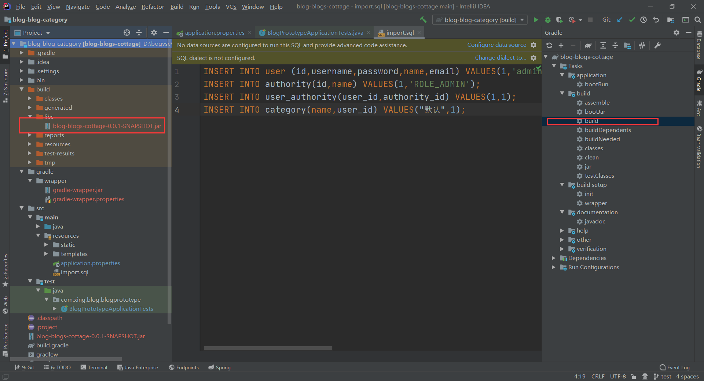

# StoppingBlog

当前github控制版本D:\bogvsc\blog-blog-category

git链接：https://github.com/stopping5/newblog.git

## 1、配置环境

1、mysql 5.7+

2、Java

3、MongoDB

4、ElasticSearch

## 2、gradle 打jar在服务器运行

在服务器运行：

## keng

1、静态文件访问失败问题

https://blog.csdn.net/weixin_30715523/article/details/99915424

路径前面不要加/

