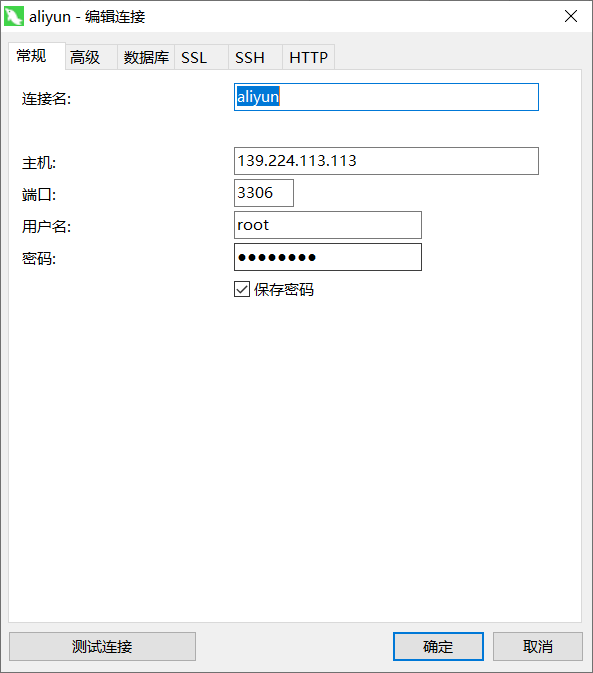
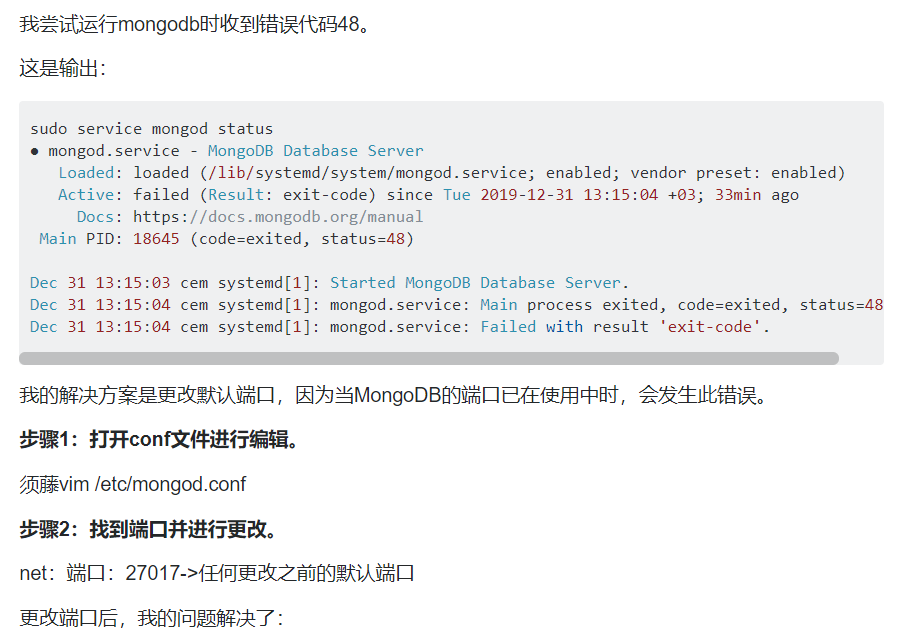
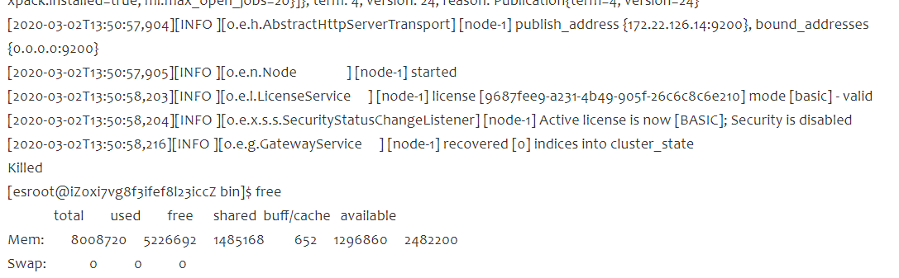

# 阿里云 Centos7

## 注意

服务器绑定的地址必须是0.0.0.0,0.0.0.0是一个特殊的IP地址，指的是本机的全部IP地址。如果一个应用绑定了0.0.0.0上的某个端口，意味着只要是发往这个端口的请求，不管是来自哪个IP地址，都会由这个应用处理。一般服务器都是多网卡的。采坑：用localhost或者127.0.0.1导致无法访问。

## java

1、安装java环境 1、官方下载jdk链接：https://pan.baidu.com/s/1Oqt9NJp3Q-IWwHfTkksuyw 
提取码：sygx 
复制这段内容后打开百度网盘手机App，操作更方便哦

2、创建安装目录：mkdir /usr/local/java/

3、解压到安装目录：tar -zxvf jdk-8u171-linux-x64.tar.gz -C /usr/local/java/

4、设置环境变量：vim /etc/profile

```
export JAVA_HOME=/usr/local/java/jdk1.8.0_171
export JRE_HOME=${JAVA_HOME}/jre
export CLASSPATH=.:${JAVA_HOME}/lib:${JRE_HOME}/lib
export PATH=${JAVA_HOME}/bin:$PATH
```

5、使环境变量生效：source  /etc/profile

6、添加软链接（未测试）

​	ln -s /usr/local/java/jdk1.8.0_171/bin/java /usr/bin/java

7、查看是否成功

java -version


## mysql

[安装mysql参考链接](https://blog.csdn.net/wohiusdashi/article/details/89358071)

1、选择mysql服务mysql -u root -p Gaokao222.

在**根目录**启动mysql服务 [root@izldwqt8b4tm07z /]# service mysqld start

2、修改密码 

```mysql
//获取临时密码
[root@izldwqt8b4tm07z ~]# grep 'temporary password' /var/log/mysqld.log;
2020-07-22T09:11:42.710435Z 1 [Note] A temporary password is generated for root@localhost: MkBC)I.4?i3Q
2020-07-25T06:09:40.457406Z 1 [Note] A temporary password is generated for root@localhost: sy/#U=dhr8/m
2020-07-25T06:51:51.512655Z 1 [Note] A temporary password is generated for root@localhost: Ee>5.P,BilpZ

//修改密码
mysql> ALTER USER 'root'@'localhost' IDENTIFIED BY 'Gaokao222.';
Query OK, 0 rows affected (0.01 sec)

```

3、开启远程链接

```
mysql> update user set Host='%' where User='root';
Query OK, 1 row affected (0.00 sec)
Rows matched: 1  Changed: 1  Warnings: 0
mysql> flush privileges;
Query OK, 0 rows affected (0.00 sec)

```

使用mysql的用户和密码




4、基本命令

```
1、设置安全选项：
mysql_secure_installation

2、关闭MySQL
systemctl stop mysqld 

3、重启MySQL
systemctl restart mysqld 

4、查看MySQL运行状态
systemctl status mysqld 

5、设置开机启动
systemctl enable mysqld 

6、关闭开机启动
systemctl disable mysqld 

7、配置默认编码为utf8：
vi /etc/my.cnf #添加 [mysqld] character_set_server=utf8 init_connect='SET NAMES utf8'

其他默认配置文件路径： 

配置文件：/etc/my.cnf 日志文件：/var/log//var/log/mysqld.log 服务启动脚本：/usr/lib/systemd/system/mysqld.service socket文件：/var/run/mysqld/mysqld.pid
```

## MongoDB

1、官网安装教程：https://docs.mongodb.com/manual/tutorial/install-mongodb-on-red-hat/

2、使用阿里云源：baseurl=http:``//mirrors``.aliyun.com``/mongodb/yum/redhat/7Server/mongodb-org/3.2/x86_64/

3、常用命令：

```
	service mongod start 开启服务

​	service mongod status 查看状态

​	service mongod stop 停止服务

​	service mongod restart 重启服务

​	mongo 127.0.0.1:27017 打开mondo 类似进入mysql
```


4、配置

```
systemLog:
  destination: file
  logAppend: true
  path: /var/log/mongodb/mongod.log

# Where and how to store data.
storage:
  dbPath: /var/lib/mongo
  journal:
    enabled: true
#  engine:
#  wiredTiger:

# how the process runs
processManagement:
  fork: true  # fork and run in background
  pidFilePath: /var/run/mongodb/mongod.pid  # location of pidfile
  timeZoneInfo: /usr/share/zoneinfo

# network interfaces
net:
#端口
  port: 33378
#地址 必须是0.0.0.0
  bindIp: 0.0.0.0 
```

5、还原数据


2、启动服务报错




## ElasticSearch 7

1、下载

wget https://artifacts.elastic.co/downloads/elasticsearch/elasticsearch-7.0.0-linux-x86_64.tar.gz /home/app

2、解压

tar -xzvf elasticsearch-7.0.0-linux-x86_64.tar.gz  -C elasticsearch（指定文件夹）

3、用户

adduser es-admin

passwd es-admin

ed-admin gaokao222.

4、因为es不能用root用户进行运行，所以只能新建一个用户并且赋予操作文件的权限。

chown -R es-admin /filepath

5、后台 运行

./bin/elasticsearch -d

或者使用screen screen -R es   

报错解决方案：


https://blog.csdn.net/qq_35078688/article/details/85206858

https://blog.csdn.net/jiahao1186/article/details/90235771

https://www.jianshu.com/p/dc7e22611fa5

但是springboot无法启动 使用低版本的es

https://www.jianshu.com/p/1fbfde2aefa5 分词器

https://github.com/medcl/elasticsearch-analysis-ik

1、es启动无报错killed，内存未看出异常



#http端口
http.port: 33346
#java端口
transport.tcp.port: 33345


解决方案：

可能是ES节点使用的内存没到它自己设置的最大内存，但是到了服务器节点/docker/虚拟机配置的最大内存，然后被强制杀掉了

[博客连接](https://blog.csdn.net/weixin_43300503/article/details/88684279)

>查看日志也没有错误。
>后来发现是内存不够了，由于ES是运行在JVM上，JVM本身除了分配的heap内存以外，还会用到一些堆外(off heap)内存。 在小内存的机器上跑ES，如果heap划分过多，累加上堆外内存后，总的JVM使用内存量可能超过物理内存限制。 如果swap又是关闭的情况下，就会被操作系统oom killer杀掉。
>修改ES中config目录下的**jvm.options**文件
>vim jvm.options
>将
>-Xms1g
>-Xmx1g
>改为
>-Xms512m
>-Xmx512m
>就启动成功了


2、安装ik插件

[官方地址有教程](https://github.com/medcl/elasticsearch-analysis-ik)

进入es目录，./bin/elasticsearch-plugin install https://github.com/medcl/elasticsearch-analysis-ik/releases/download/v6.3.0/elasticsearch-analysis-ik-6.3.0.zip

3、IK版本问题

## Versions

| IK version | ES version       |
| ---------- | ---------------- |
| master     | 7.x -> master    |
| 6.x        | 6.x              |
| 5.x        | 5.x              |
| 1.10.6     | 2.4.6            |
| 1.9.5      | 2.3.5            |
| 1.8.1      | 2.2.1            |
| 1.7.0      | 2.1.1            |
| 1.5.0      | 2.0.0            |
| 1.2.6      | 1.0.0            |
| 1.2.5      | 0.90.x           |
| 1.1.3      | 0.20.x           |
| 1.0.0      | 0.16.2 -> 0.19.0 |


## 配置问题

目前配置：

springboot 2.13 springboot-es-starter 2.1.3 elasticsearch 6.2.2

springboot application.properties 配置文件

```
#Themeleaf 编码模式
spring.thymeleaf.encoding = UTF-8
#页面模式
spirng.themeleaf.mode = HTML5

#DataSource
spring.datasource.url=jdbc:mysql://localhost/blog?useSSL=false&serverTimezone=UTC&characterEncoding=utf-8
spring.datasource.username=root
spring.datasource.password=Gaokao222.
spring.datasource.driver-class-name=com.mysql.cj.jdbc.Driver

#JPA
spring.jpa.show-sql=false
spring.jpa.hibernate.ddl-auto = update
#ElasticSearch 服务地址 
#es集群名称 必须与es配置文件cluster.name对应
spring.data.elasticsearch.cluster-name = blog-es
#es集群地址
spring.data.elasticsearch.cluster-nodes = 127.0.0.1:33346
#是否本地连接
spring.data.elasticsearch.local = false
#设置连接超时时间
spring.data.elasticsearch.properties.transport.tcp.connect_timeout=120s

#文件服务器地址
file.server.url = http://www.stopping.top:8081/upload

#设置接收字长
server.max-http-header-size=102400
#百度站长推送址址
baidu.site.url = http://data.zz.baidu.com/urls?site=www.stopping.top&token=imD2Vf3o3v1gi0e7
#个人网站地址
my.site.url = http://www.stopping.top
```

elastisearch.yml

```yml
#集群名称
cluster.name: blog-es
#本节点名称
node.name: node-1
bootstrap.memory_lock: false
bootstrap.system_call_filter: false
#可以访问es集群的ip  0.0.0.0表示不绑定
network.bind_host: 0.0.0.0
#es集群相互通信的ip  0.0.0.0默认本地网络搜索
network.publish_host: 0.0.0.0
#http端口
http.port: 33345
#java端口
transport.tcp.port: 33346
#是否master节点
node.master: true
#是否存储数据
node.data: true
#跨域设置
http.cors.enabled: true
http.cors.allow-origin: "*"

```

jvm.options

```
## JVM configuration

################################################################
## IMPORTANT: JVM heap size
################################################################
##
## You should always set the min and max JVM heap
## size to the same value. For example, to set
## the heap to 4 GB, set:
##
## -Xms4g
## -Xmx4g
##
## See https://www.elastic.co/guide/en/elasticsearch/reference/current/heap-size.html
## for more information
##
################################################################

# Xms represents the initial size of total heap space
# Xmx represents the maximum size of total heap space

#修改 本来1g
-Xms512m
-Xmx512m

################################################################
## Expert settings
################################################################
##
## All settings below this section are considered
## expert settings. Don't tamper with them unless
## you understand what you are doing
##
################################################################

## GC configuration
-XX:+UseConcMarkSweepGC
-XX:CMSInitiatingOccupancyFraction=75
-XX:+UseCMSInitiatingOccupancyOnly

## optimizations

# pre-touch memory pages used by the JVM during initialization
-XX:+AlwaysPreTouch

## basic

# explicitly set the stack size
-Xss1m

# set to headless, just in case
-Djava.awt.headless=true

# ensure UTF-8 encoding by default (e.g. filenames)
-Dfile.encoding=UTF-8

# use our provided JNA always versus the system one
-Djna.nosys=true

# turn off a JDK optimization that throws away stack traces for common
# exceptions because stack traces are important for debugging
-XX:-OmitStackTraceInFastThrow

# flags to configure Netty
-Dio.netty.noUnsafe=true
-Dio.netty.noKeySetOptimization=true
-Dio.netty.recycler.maxCapacityPerThread=0

# log4j 2
-Dlog4j.shutdownHookEnabled=false
-Dlog4j2.disable.jmx=true

-Djava.io.tmpdir=${ES_TMPDIR}

## heap dumps

# generate a heap dump when an allocation from the Java heap fails
# heap dumps are created in the working directory of the JVM
-XX:+HeapDumpOnOutOfMemoryError

# specify an alternative path for heap dumps
# ensure the directory exists and has sufficient space
#-XX:HeapDumpPath=/heap/dump/path

## JDK 8 GC logging

8:-XX:+PrintGCDetails
8:-XX:+PrintGCDateStamps
8:-XX:+PrintTenuringDistribution
8:-XX:+PrintGCApplicationStoppedTime
8:-Xloggc:logs/gc.log
8:-XX:+UseGCLogFileRotation
8:-XX:NumberOfGCLogFiles=32
8:-XX:GCLogFileSize=64m

# JDK 9+ GC logging
9-:-Xlog:gc*,gc+age=trace,safepoint:file=logs/gc.log:utctime,pid,tags:filecount=32,filesize=64m
# due to internationalization enhancements in JDK 9 Elasticsearch need to set the provider to COMPAT otherwise
# time/date parsing will break in an incompatible way for some date patterns and locals
9-:-Djava.locale.providers=COMPAT

```


## 服务器运维

### 1、解决内存不足的问题

一般情况下阿里云新购的linux系统是没有swap分区的,内存较小时,可以使用swap分区来分担一下物理内存的压力。

- 查看是否已经开启swap分区

  - ```
    cat /proc/swaps 
    Filename                                Type            Size    Used    Priority
    ```

- 如果没有启动swap分区，则新建一个swap分区

  ```bash
  dd if=/dev/zero of=/swap_file bs=1M count=2048
  注：此文件的大小是count的大小乘以bs大小，上面命令的大小是2GB
  ```

- 通过mkswap命令将上面新建出的文件做成swap分区

  ```
  mkswap /swap_file
  ```

- 启用swap分区

  ```
  swapon /swap_file
  ```

- 如果启用成功

  ```
  [root@izldwqt8b4tm07z ~]# cat /proc/swaps
  Filename                                Type            Size    Used    Priority
  /swap_file                              file            8388604 235520  -2
  ```

- 设置自动挂载

  ```bash
  echo "/data/swap swap swap defaults    0  0" >> /etc/fstab
  ```

- 设置内存在什么情况下使用swap交换区

  ```bash
  //查看swappiness数值，如果是0则表示最大限度的物理内存，只有物理内存只用完了才使用swap分区。当swappiness内容的值为100时,表示积极地使用SWAP分区,并且把内存中的数据及时地置换到SWAP分区。注：若想永久修改，则编辑/etc/sysctl.conf文件
  cat /proc/sys/vm/swappiness 
  //修改swappiness值
  sysctl -w vm.swappiness=60
  ```

- （备）如果需要关闭swap分区

  ```
  swapoff /swap_file
  ```

# 启动服务

springboot 有读取外部配置文件的方法，如下优先级：

第一种是在jar包的同一目录下建一个config文件夹，然后把配置文件放到这个文件夹下。

第二种是直接把配置文件放到jar包的同级目录。

第三种在classpath下建一个config文件夹，然后把配置文件放进去。

第四种是在classpath下直接放配置文件


# 需求

1、新增评论功能 并能实时推送作者

实现：通知表、评论表、定时器

