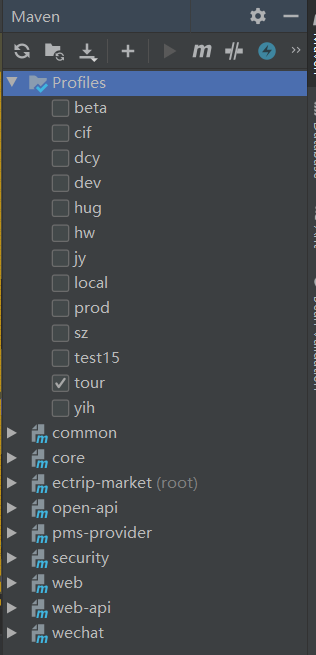
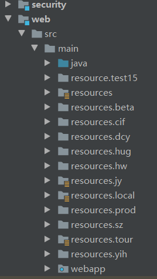
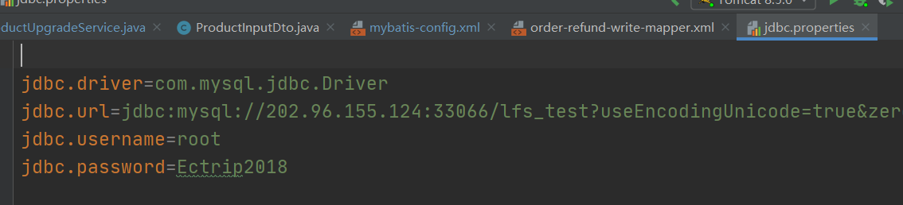
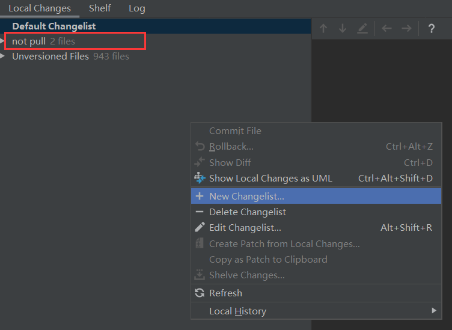

# 设置内容

### 1、tomcat8+在IDEA乱码？

在setting中设置fileEncoding = utf-8

设置tomcat中文：-Dfile.encoding=UTF-8

【实在不行】IDEA安装目录bin/idea64.exe.vmoptions 打开 添加一行配置 -Dfile.encoding=UTF-8

### 2、jar引用不到问题

在project settings libraries重新导入

导入路径

H:\ideaWorkspace\weifuwu\ectrip-market\web\src\main\webapp\WEB-INF\lib

将项目中lib的jar导入。

### 3 、Tomcat热部署

一、配置tomcat

二、添加依赖

3、删除第一个war包

4、返回server

### 4、IEAD切换数据源

（1）maven切换数据源

（2）在Web模块下查看数据源配置是否正确

（3）重启服务器（不行则刷新maven）

# 代码管理

## 1、修改代码之前一定要先pull避免冲突

## 2、新建的文件需要add之后再commit

## 3、静态页面存放在src下面

路径：H:\ideaWorkspace\weifuwu\ectrip-market\web\src\main\webapp\WEB-INF\templates\wechat\malls

## 4、不用提交的代码 右键->new channel

