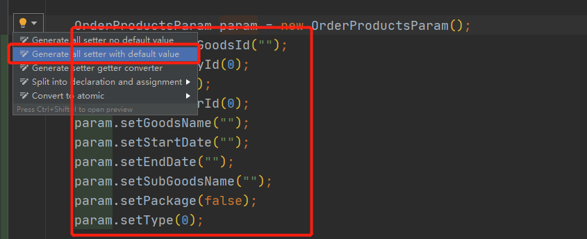

# 插件整理

## 1、GenerateAllSetter 调用对象所有set方法

## 2、MyBatisCodeHelperPro 单表代码生成

## 3、Rainbow Brackets  代码区域括号高亮

## 4、Translation idea内置翻译

## 5、VisualVM Launcher JVM 调试插件 

## 6、**Maven Helper**  maven依赖工具

## 7、**GsonFormat** 根据json生成java类

## 8、**FindBugs** 检查代码中的bug

## 9、**lombok** getset data注解使用

