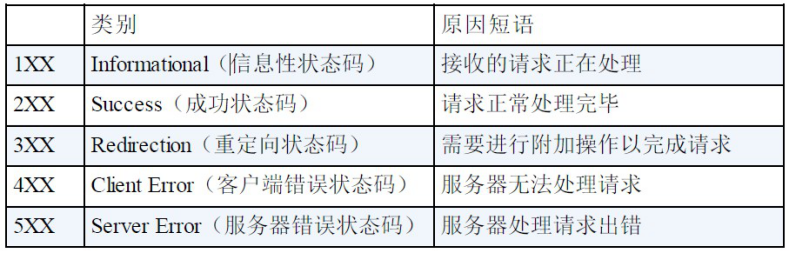

# 一、基本原理

# 二、HTTP通信协议的组成

## 1、请求 URI 定位资源

URI 用字符串标识某一互联网资源，而 URL 表示资源的地点（互联网上所处的位置）。可见 URL 是 URI 的 子 集 。

http://www.gupaoedu.com:80/java/index.html?name=mic#head 

==schema==://==host==[:==port==#]/===path==/.../?[url-params]#[ query-string] 

- scheme：指定应用层使用的协议(例如：http, https, ftp) 

- host：HTTP 服务器的 IP 地址或者域名

- port#：HTTP 服务器的默认端口是 80，这种情况下端口号可以省略。如果使用了别的端口，必须指明，例如 http://www.cnblogs.com:8080/

- path：访问资源的路径
- url-params:提交的参数

- query-string：查询字符串

- \#	片段标识符（使用片段标识符通常可标记出已获取资源中的子资源（文档内的某个位置））

通过这个 url 地址，我们就可以读到，当前用户要使用 http 协议访问指定服务器上对应进程中的资源，并且携带了请求参数。

## 2、MIME Type

服务器根据用户请求的资源找到对应的文件以后，会返回一个资源给到客户端浏览器，浏览器会对这个资源解析并且渲染。但是服务器上的资源类型有很多，比如图片类型、视频类型、Js、Css、文本等。浏览器如何识别当前类型做不同的渲染呢？

MIME Type：是描述==消息内容类型==的因特网标准，常见的几种类型

- 文本文件：text/html,text/plain,text/css,application/xhtml+xml,application/xml 

- 图片文件：image/jpeg,image/gif,image/png.

- 视频文件：video/mpeg,video/quicktime

我们可以通过两种方式来设置文件的渲染类型，第一种是 Accept，第二种是 Content-Type

- Accept: 表示==客户端==希望接受的数据类型，即告诉服务器我需要什么媒体类型的数据，此时服务器应该根据 Accept 请求头生产指定媒体类型的数据

- Content-Type: 表示==发送端==发送的实体数据类型， 比如我们应该写过类似的： resposne.setContentType(“application/json;charset=utf-8”)的代码，表示服务端返回的数据格式是json。

> 如果 Accept 和Content-Type 不一致，假如说 Accept 要接收的类型是image/gif，但是服务端返回的数据是text/html，那么浏览器将会无法解析。

## 3、状态码

## 4、请求类型

- GET：一般是用于客户端发送一个 URI 地址去获取服务端的资源（一般用于查询操作），Get不支持的传输数据有限制，具体限制由浏览器决定
- POST：一般用户客户端传输一个实体给到服务端，让服务端去保存（一般用于创建操作）

-  PUT：向服务器发送数据，一般用于更新数据的操作
- DELETE：客户端发起一个Delete 请求要求服务端把某个数据删除（一般用于删除操作） 
- HEAD:获得报文首部
- OPTIONS：询问支持的方法
- TRACE：追踪路径
- CONNECT：用隧道协议连接代理